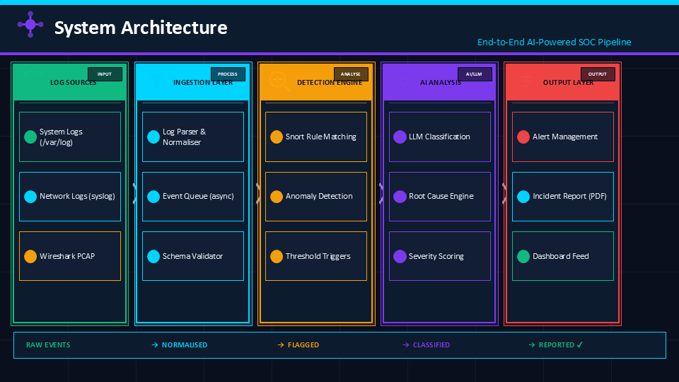
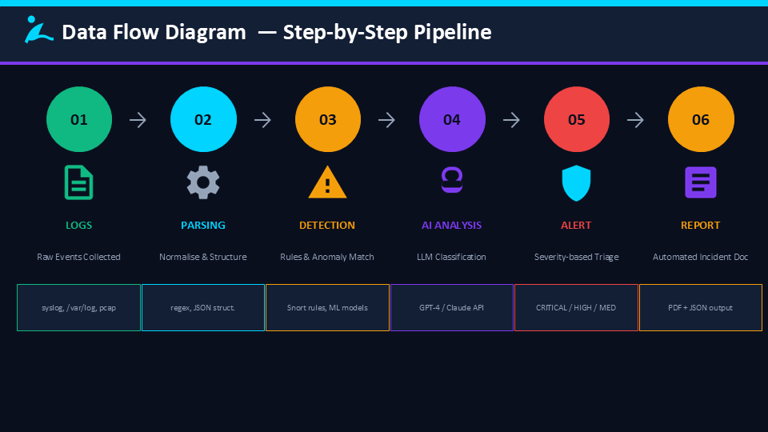
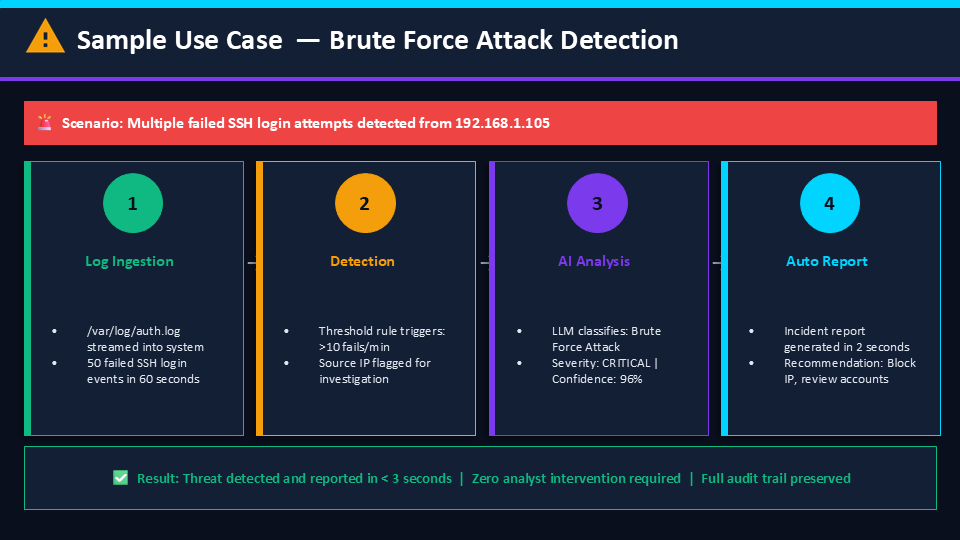

# 🔐 AI-Powered SOC Alert Analysis System

## 📌 Overview
This project simulates a **Security Operations Center (SOC)** using AI to automate **log analysis, threat detection, and incident reporting**.

It demonstrates how **AI can transform cybersecurity operations** by reducing manual effort and improving response time.

---

## 🏗️ System Architecture


---

## 🔄 Data Flow


---

## 🚨 Sample Use Case


---

## 🎯 Key Features
- 🔍 Log ingestion from system and network sources  
- 🚨 Threat detection using rules and anomaly patterns  
- 🤖 AI-based alert classification and prioritisation  
- 📝 Automated incident report generation  

---

## 🛠️ Tech Stack
- Python  
- Wireshark / tshark  
- Linux  
- LLM APIs (GPT / Claude)  

---

## 🌍 Real-World Relevance
- Simulates **actual SOC workflows**
- Covers **end-to-end security pipeline**
- Demonstrates **AI + Cybersecurity integration**

---

## 📄 Project Documentation
👉 [View Full Project (PDF)](docs/Lopamudra_AI_SOC_System.pdf)

---

## 👩‍💻 About Me
**Lopamudra Panigrahi**  
Software Test Engineer → Transitioning into AI & Cybersecurity  

---

## 🚀 What This Shows
- System design thinking  
- Real-world problem solving  
- Ability to apply AI in security workflows  
- End-to-end SOC pipeline simulation  

---

## 🔬 Demo — End-to-End Flow

### 📥 Sample Input Logs
```
Mar 27 10:01:12 Failed password from 192.168.1.105
Mar 27 10:01:15 Failed password from 192.168.1.105
Mar 27 10:01:18 Failed password from 192.168.1.105
```
👉 Full logs available in: data/sample_logs.txt

---

### 🚨 Detection Output
```json
{
  "event_type": "Brute Force Attack",
  "source_ip": "192.168.1.105",
  "severity": "HIGH"
}
```

👉 Full output available in: output/detection.json


---

### AI Incident Summary
```
Brute Force Attack detected from 192.168.1.105
Severity: CRITICAL
Recommendation: Block IP and review logs

```
## ▶️ Python Demo

This project also includes a simple Python simulation script:

```bash
python soc_demo.py
```

### What it does
- Reads sample logs from `data/sample_logs.txt`
- Detects repeated failed SSH login attempts
- Flags brute force activity based on a threshold
- Prints an AI-style incident summary

### Example Output
```text
Reading logs...

Detected Alerts:
{'event_type': 'Brute Force Attack', 'source_ip': '192.168.1.105', 'attempt_count': 5, 'severity': 'HIGH'}

Incident Type: Brute Force Attack

Summary:
Multiple failed SSH login attempts were detected from IP address 192.168.1.105.

Analysis:
The pattern indicates a brute force attack attempting unauthorized access.

Severity: CRITICAL

Recommended Actions:
- Block the source IP immediately
- Review authentication logs
- Enforce stronger password policies
- Enable multi-factor authentication
```
